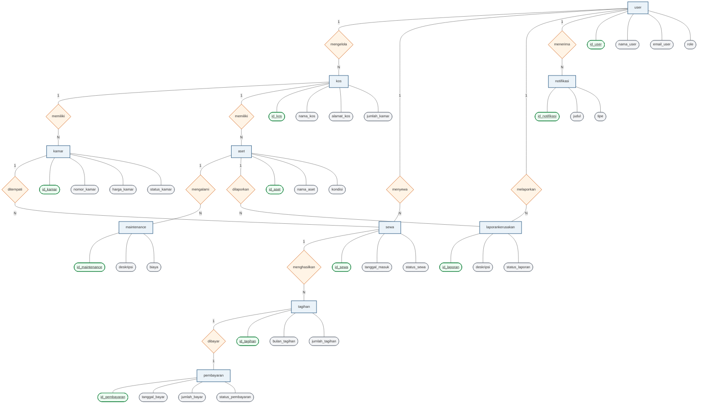

# Dokumentasi Struktur Database & Entity Relationship Diagram (ERD)
Sistem Manajemen Kos (Laravel Microservices)

Dokumen ini menjelaskan rancangan database terpusat (**Shared Database Pattern**) yang digunakan oleh sistem manajemen kos microservices ini. Sistem ini memiliki 5 microservices utama dan 1 API Gateway, yang beroperasi pada satu database MySQL bersama bernama `microservices_db`.

---

## 🏗️ Pola Manajemen Database: Shared Database

Sistem ini menerapkan **Shared Database Pattern** di mana seluruh microservices terhubung ke satu database fisik yang sama. 

```
┌─────────────────┐ ┌─────────────────┐ ┌─────────────────┐ ┌─────────────────┐ ┌─────────────────┐
│  Auth Service   │ │Property Service │ │ Payment Service │ │Complaint Service│ │Notification Svc │
└────────┬────────┘ └────────┬────────┘ └────────┬────────┘ └────────┬────────┘ └────────┬────────┘
         │                   │                   │                   │                   │
         └───────────────────┼───────────────────┼───────────────────┼───────────────────┘
                             ▼
                ┌─────────────────────────┐
                │ MySQL: microservices_db │
                └─────────────────────────┘
```

### Keuntungan dalam Konteks Laravel:
- **Integritas Referensial**: Relasi kunci asing (*Foreign Keys*) tetap ditegakkan di level database (`ON DELETE CASCADE`, dll.).
- **Kemudahan Query & Eloquent**: Laravel Eloquent Models tetap dapat mendefinisikan relasi standar (`belongsTo`, `hasMany`) secara langsung sehingga mempercepat pengembangan dan menjamin performa query.
- **Konsistensi Migrasi**: File migrasi dan seeder dikelola di satu direktori terpusat (`database/migrations` dan `database/seeders`) dan dijalankan dengan sekali perintah.

---

## 📂 Pemetaan Tabel ke Microservices

Masing-masing dari 10 tabel relasional dimiliki secara logis oleh microservice tertentu yang bertanggung jawab penuh atas manipulasi datanya (*ownership*):

| Nama Layanan (Microservice) | Tabel yang Dikelola | Tanggung Jawab Utama |
|---|---|---|
| **Auth Service** (Port `8001`) | `users` | Otentikasi JWT, registrasi owner & penghuni, verifikasi dokumen pendukung. |
| **Property Service** (Port `8002`) | `kos`, `kamar`, `aset`, `maintenance` | Manajemen data properti kos, kamar (tipe & kapasitas), aset fasilitas, dan penjadwalan pemeliharaan. |
| **Payment Service** (Port `8003`) | `sewa`, `tagihan`, `pembayaran` | Manajemen transaksi sewa aktif, auto-generate tagihan bulanan, integrasi payment gateway (manual, midtrans, xendit). |
| **Complaint Service** (Port `8005`) | `laporankerusakan` | Pencatatan laporan kerusakan fasilitas dari penghuni dan koordinasinya dengan data aset terkait. |
| **Notification Service** (Port `8007`) | `notifikasi` | Log history notifikasi sistem (info, tagihan, laporan kerusakan) yang dikirim ke pengguna. |

---

## 📊 Entity Relationship Diagram (ERD)

Berikut adalah visualisasi hubungan antar-tabel dalam sistem manajemen kos menggunakan diagram Mermaid:

```mermaid
erDiagram
    %% Auth Service
    USERS {
        bigint id PK
        string nama_user
        string email_user UK
        string password_user
        enum role "owner, pengelola_kos, user"
        string nohp_user
        string dokumen_pendukung
        timestamp email_verified_at
        timestamps timestamps
        softDeletes deleted_at
    }

    %% Property Service
    KOS {
        bigint id PK
        string nama_kos
        text alamat_kos
        integer jumlah_kamar
        bigint id_user FK "Ref: users.id"
        timestamps timestamps
        softDeletes deleted_at
    }

    KAMAR {
        bigint id PK
        string nomor_kamar
        string tipe_kamar
        integer kapasitas_kamar
        decimal harga_kamar "12,2"
        enum status_kamar "tersedia, terisi, maintenance, tidak_tersedia, segera"
        text deskripsi_kamar
        bigint id_kos FK "Ref: kos.id"
        timestamps timestamps
        softDeletes deleted_at
    }

    ASET {
        bigint id PK
        string nama_aset
        string kategori
        date tanggal_pembelian
        decimal harga "12,2"
        enum kondisi "baik, rusak_ringan, rusak_berat"
        bigint id_kos FK "Ref: kos.id"
        timestamps timestamps
        softDeletes deleted_at
    }

    MAINTENANCE {
        bigint id PK
        text deskripsi
        decimal biaya "12,2"
        date tanggal_perbaikan
        enum status "dijadwalkan, sedang_dikerjakan, selesai"
        bigint id_aset FK "Ref: aset.id"
        timestamps timestamps
    }

    %% Payment Service
    SEWA {
        bigint id PK
        date tanggal_masuk
        date tanggal_keluar
        enum status_sewa "aktif, berakhir, dibatalkan"
        decimal harga_sewa "12,2"
        bigint id_user FK "Ref: users.id"
        bigint id_kamar FK "Ref: kamar.id"
        timestamps timestamps
        softDeletes deleted_at
    }

    TAGIHAN {
        bigint id PK
        string bulan_tagihan
        date tanggal_jatuhtempo
        decimal jumlah_tagihan "14,2"
        enum status_tagihan "belum_bayar, lunas, terlambat"
        bigint id_sewa FK "Ref: sewa.id"
        timestamps timestamps
    }

    PEMBAYARAN {
        bigint id PK
        timestamp tanggal_bayar
        enum metode_pembayaran "transfer_bank, e_wallet, tunai"
        decimal jumlah_bayar "14,2"
        enum status_pembayaran "pending, berhasil, gagal"
        enum payment_gateway "manual, xendit, midtrans"
        string external_id UK
        enum status_webhook "waiting, received, verified"
        bigint id_tagihan FK "Ref: tagihan.id"
        timestamps timestamps
    }

    %% Complaint Service
    LAPORANKERUSAKAN {
        bigint id PK
        timestamp tanggal_lapor
        enum status_laporan "dilaporkan, diproses, selesai"
        text deskripsi
        string foto
        bigint id_user FK "Ref: users.id"
        bigint id_aset FK "Ref: aset.id"
        timestamps timestamps
        softDeletes deleted_at
    }

    %% Notification Service
    NOTIFIKASI {
        bigint id PK
        bigint id_user FK "Ref: users.id"
        string judul
        text pesan
        enum tipe "info, peringatan, pembayaran, laporan"
        boolean dibaca
        bigint id_terkait
        string tipe_terkait
        timestamps timestamps
    }

    %% Relationships
    USERS ||--o{ KOS : "mengelola"
    USERS ||--o{ SEWA : "menyewa"
    USERS ||--o{ LAPORANKERUSAKAN : "melaporkan"
    USERS ||--o{ NOTIFIKASI : "menerima"

    KOS ||--o{ KAMAR : "memiliki"
    KOS ||--o{ ASET : "memiliki"

    ASET ||--o{ MAINTENANCE : "mengalami"
    ASET ||--o{ LAPORANKERUSAKAN : "dilaporkan_pada"

    KAMAR ||--o{ SEWA : "ditempati"

    SEWA ||--o{ TAGIHAN : "menghasilkan"
    TAGIHAN ||--o{ PEMBAYARAN : "dibayar_oleh"
```



---

## 📊 Diagram ERD Model Chen (Model Klasik)

Berikut adalah visualisasi ERD dengan **Notasi Chen (Model Klasik)**, di mana:
- **Persegi Panjang** = Entitas (Entity)
- **Belah Ketupat** = Hubungan (Relationship) dengan label kardinalitas (1 ke N)
- **Elips/Oval** = Atribut (Attribute) dengan garis bawah `<u>` sebagai Primary Key (PK)



---

## 📝 Kamus Data (Spesifikasi Detail Tabel)

Berikut adalah daftar spesifikasi lengkap 10 tabel relasional yang digunakan oleh sistem manajemen kos microservices ini, dengan format penulisan standar laporan tugas akhir/skripsi.

### 1. Tabel User
Menyimpan informasi data pengguna (owner, pengelola, dan penghuni).

*Tabel 3. 21 Spesifikasi Tabel User*
| No. | Nama Field | Type | Keterangan |
| :--- | :--- | :--- | :--- |
| 1. | `id_user` | INT(11) | Primary Key, Auto Increment |
| 2. | `nama_user` | VARCHAR(255) | Nama lengkap pengguna |
| 3. | `email_user` | VARCHAR(255) | Email pengguna (Unique) |
| 4. | `password_user` | VARCHAR(255) | Kata sandi pengguna (Bcrypt hash) |
| 5. | `role` | ENUM('owner', 'pengelola_kos', 'user') | Peran/hak akses pengguna |
| 6. | `nohp_user` | VARCHAR(255) | Nomor HP/WhatsApp pengguna |
| 7. | `dokumen_pendukung` | VARCHAR(255) | File/URL dokumen pendukung (KTP/ID, Nullable) |
| 8. | `email_verified_at` | TIMESTAMP | Tanggal verifikasi email (Nullable) |
| 9. | `created_at` | TIMESTAMP | Tanggal data dibuat |
| 10. | `updated_at` | TIMESTAMP | Tanggal data diperbarui |
| 11. | `deleted_at` | TIMESTAMP | Tanggal data dihapus (Soft Delete, Nullable) |

### 2. Tabel Kos
Menyimpan informasi data kos yang dimiliki oleh pemilik.

*Tabel 3. 22 Spesifikasi Tabel Kos*
| No. | Nama Field | Type | Keterangan |
| :--- | :--- | :--- | :--- |
| 1. | `id_kos` | INT(11) | Primary Key, Auto Increment |
| 2. | `nama_kos` | VARCHAR(255) | Nama kos |
| 3. | `alamat_kos` | TEXT | Alamat lengkap kos |
| 4. | `jumlah_kamar` | INT(11) | Jumlah total kamar |
| 5. | `id_user` | INT(11) | Foreign Key -> user(id_user), pemilik kos |
| 6. | `created_at` | TIMESTAMP | Tanggal data dibuat |
| 7. | `updated_at` | TIMESTAMP | Tanggal data diperbarui |
| 8. | `deleted_at` | TIMESTAMP | Tanggal data dihapus (Soft Delete, Nullable) |

### 3. Tabel Kamar
Menyimpan informasi detail unit kamar di dalam kos.

*Tabel 3. 23 Spesifikasi Tabel Kamar*
| No. | Nama Field | Type | Keterangan |
| :--- | :--- | :--- | :--- |
| 1. | `id_kamar` | INT(11) | Primary Key, Auto Increment |
| 2. | `nomor_kamar` | VARCHAR(255) | Nomor atau kode unit kamar |
| 3. | `tipe_kamar` | VARCHAR(255) | Tipe/klasifikasi kamar (VIP, Deluxe, Standard, Nullable) |
| 4. | `kapasitas_kamar` | INT(11) | Kapasitas maksimal penghuni kamar |
| 5. | `harga_kamar` | DECIMAL(12,2) | Harga sewa kamar per bulan |
| 6. | `status_kamar` | ENUM('tersedia', 'terisi', 'maintenance', 'tidak_tersedia', 'segera') | Status ketersediaan kamar |
| 7. | `deskripsi_kamar` | TEXT | Deskripsi fasilitas kamar (Nullable) |
| 8. | `id_kos` | INT(11) | Foreign Key -> kos(id_kos), kos tempat kamar berada |
| 9. | `created_at` | TIMESTAMP | Tanggal data dibuat |
| 10. | `updated_at` | TIMESTAMP | Tanggal data diperbarui |
| 11. | `deleted_at` | TIMESTAMP | Tanggal data dihapus (Soft Delete, Nullable) |

### 4. Tabel Aset
Menyimpan informasi data barang/aset fasilitas kos.

*Tabel 3. 24 Spesifikasi Tabel Aset*
| No. | Nama Field | Type | Keterangan |
| :--- | :--- | :--- | :--- |
| 1. | `id_aset` | INT(11) | Primary Key, Auto Increment |
| 2. | `nama_aset` | VARCHAR(255) | Nama barang/aset fasilitas |
| 3. | `kategori` | VARCHAR(255) | Kategori aset (Elektronik, Furniture, Nullable) |
| 4. | `tanggal_pembelian` | DATE | Tanggal pembelian aset |
| 5. | `harga` | DECIMAL(12,2) | Harga pembelian aset |
| 6. | `kondisi` | ENUM('baik', 'rusak_ringan', 'rusak_berat') | Kondisi aset saat ini |
| 7. | `id_kos` | INT(11) | Foreign Key -> kos(id_kos), pemilik aset |
| 8. | `created_at` | TIMESTAMP | Tanggal data dibuat |
| 9. | `updated_at` | TIMESTAMP | Tanggal data diperbarui |
| 10. | `deleted_at` | TIMESTAMP | Tanggal data dihapus (Soft Delete, Nullable) |

### 5. Tabel Maintenance
Menyimpan informasi log perbaikan aset yang rusak.

*Tabel 3. 25 Spesifikasi Tabel Maintenance*
| No. | Nama Field | Type | Keterangan |
| :--- | :--- | :--- | :--- |
| 1. | `id_maintenance` | INT(11) | Primary Key, Auto Increment |
| 2. | `deskripsi` | TEXT | Deskripsi detail perbaikan aset |
| 3. | `biaya` | DECIMAL(12,2) | Total biaya perbaikan |
| 4. | `tanggal_perbaikan` | DATE | Tanggal dilaksanakannya perbaikan |
| 5. | `status` | ENUM('dijadwalkan', 'sedang_dikerjakan', 'selesai') | Status proses perbaikan |
| 6. | `id_aset` | INT(11) | Foreign Key -> aset(id_aset), aset yang diperbaiki |
| 7. | `created_at` | TIMESTAMP | Tanggal data dibuat |
| 8. | `updated_at` | TIMESTAMP | Tanggal data diperbarui |

### 6. Tabel Sewa
Menyimpan informasi transaksi kontrak sewa kamar oleh penghuni.

*Tabel 3. 26 Spesifikasi Tabel Sewa*
| No. | Nama Field | Type | Keterangan |
| :--- | :--- | :--- | :--- |
| 1. | `id_sewa` | INT(11) | Primary Key, Auto Increment |
| 2. | `tanggal_masuk` | DATE | Tanggal check-in penyewa |
| 3. | `tanggal_keluar` | DATE | Tanggal check-out penyewa (Nullable) |
| 4. | `status_sewa` | ENUM('aktif', 'berakhir', 'dibatalkan') | Status masa sewa |
| 5. | `harga_sewa` | DECIMAL(12,2) | Harga sewa deal yang dikunci (Nullable) |
| 6. | `id_user` | INT(11) | Foreign Key -> user(id_user), penghuni yang menyewa |
| 7. | `id_kamar` | INT(11) | Foreign Key -> kamar(id_kamar), kamar yang disewa |
| 8. | `created_at` | TIMESTAMP | Tanggal data dibuat |
| 9. | `updated_at` | TIMESTAMP | Tanggal data diperbarui |
| 10. | `deleted_at` | TIMESTAMP | Tanggal data dihapus (Soft Delete, Nullable) |

### 7. Tabel Tagihan
Menyimpan informasi tagihan bulanan berkala dari sewa kamar.

*Tabel 3. 27 Spesifikasi Tabel Tagihan*
| No. | Nama Field | Type | Keterangan |
| :--- | :--- | :--- | :--- |
| 1. | `id_tagihan` | INT(11) | Primary Key, Auto Increment |
| 2. | `bulan_tagihan` | VARCHAR(255) | Bulan tagihan (misal: "Juli 2026") |
| 3. | `tanggal_jatuhtempo` | DATE | Batas akhir pembayaran |
| 4. | `jumlah_tagihan` | DECIMAL(14,2) | Nominal tagihan |
| 5. | `status_tagihan` | ENUM('belum_bayar', 'lunas', 'terlambat') | Status pelunasan tagihan |
| 6. | `id_sewa` | INT(11) | Foreign Key -> sewa(id_sewa), sewa terkait |
| 7. | `created_at` | TIMESTAMP | Tanggal data dibuat |
| 8. | `updated_at` | TIMESTAMP | Tanggal data diperbarui |

### 8. Tabel Pembayaran
Menyimpan informasi transaksi pembayaran tagihan kos.

*Tabel 3. 28 Spesifikasi Tabel Pembayaran*
| No. | Nama Field | Type | Keterangan |
| :--- | :--- | :--- | :--- |
| 1. | `id_pembayaran` | INT(11) | Primary Key, Auto Increment |
| 2. | `tanggal_bayar` | TIMESTAMP | Tanggal pembayaran lunas (Nullable) |
| 3. | `metode_pembayaran` | ENUM('transfer_bank', 'e_wallet', 'tunai') | Metode pembayaran |
| 4. | `jumlah_bayar` | DECIMAL(14,2) | Nominal yang dibayar |
| 5. | `status_pembayaran` | ENUM('pending', 'berhasil', 'gagal') | Status transaksi |
| 6. | `payment_gateway` | ENUM('manual', 'xendit', 'midtrans') | Vendor gateway pembayaran |
| 7. | `external_id` | VARCHAR(255) | ID referensi unik payment gateway (Unique, Nullable) |
| 8. | `status_webhook` | ENUM('waiting', 'received', 'verified') | Status penanganan callback webhook |
| 9. | `id_tagihan` | INT(11) | Foreign Key -> tagihan(id_tagihan), tagihan yang dibayar |
| 10. | `created_at` | TIMESTAMP | Tanggal data dibuat |
| 11. | `updated_at` | TIMESTAMP | Tanggal data diperbarui |

### 9. Tabel Laporan Kerusakan
Menyimpan aduan pengaduan kerusakan aset dari penghuni.

*Tabel 3. 29 Spesifikasi Tabel Laporan Kerusakan*
| No. | Nama Field | Type | Keterangan |
| :--- | :--- | :--- | :--- |
| 1. | `id_laporan` | INT(11) | Primary Key, Auto Increment |
| 2. | `tanggal_lapor` | TIMESTAMP | Tanggal aduan dikirim |
| 3. | `status_laporan` | ENUM('dilaporkan', 'diproses', 'selesai') | Status penanganan aduan |
| 4. | `deskripsi` | TEXT | Kronologis kerusakan barang |
| 5. | `foto` | VARCHAR(255) | Foto bukti kerusakan (Nullable) |
| 6. | `id_user` | INT(11) | Foreign Key -> user(id_user), pelapor (penghuni) |
| 7. | `id_aset` | INT(11) | Foreign Key -> aset(id_aset), barang yang rusak |
| 8. | `created_at` | TIMESTAMP | Tanggal data dibuat |
| 9. | `updated_at` | TIMESTAMP | Tanggal data diperbarui |
| 10. | `deleted_at` | TIMESTAMP | Tanggal data dihapus (Soft Delete, Nullable) |

### 10. Tabel Notifikasi
Menyimpan data log pengiriman notifikasi sistem ke pengguna.

*Tabel 3. 30 Spesifikasi Tabel Notifikasi*
| No. | Nama Field | Type | Keterangan |
| :--- | :--- | :--- | :--- |
| 1. | `id_notifikasi` | INT(11) | Primary Key, Auto Increment |
| 2. | `id_user` | INT(11) | Foreign Key -> user(id_user), target penerima notifikasi |
| 3. | `judul` | VARCHAR(255) | Judul notifikasi |
| 4. | `pesan` | TEXT | Isi notifikasi |
| 5. | `tipe` | ENUM('info', 'peringatan', 'pembayaran', 'laporan') | Kategori notifikasi |
| 6. | `dibaca` | TINYINT(1) | Status baca (0 = belum, 1 = sudah) |
| 7. | `id_terkait` | INT(11) | ID entitas terkait (Nullable) |
| 8. | `tipe_terkait` | VARCHAR(255) | Jenis/model entitas terkait (Nullable) |
| 9. | `created_at` | TIMESTAMP | Tanggal data dibuat |
| 10. | `updated_at` | TIMESTAMP | Tanggal data diperbarui |


